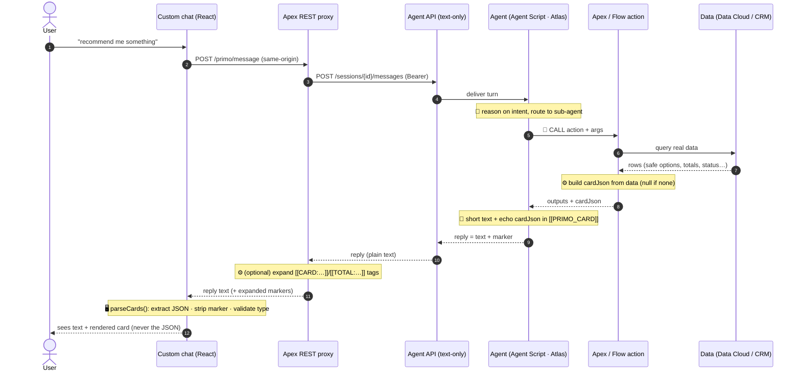
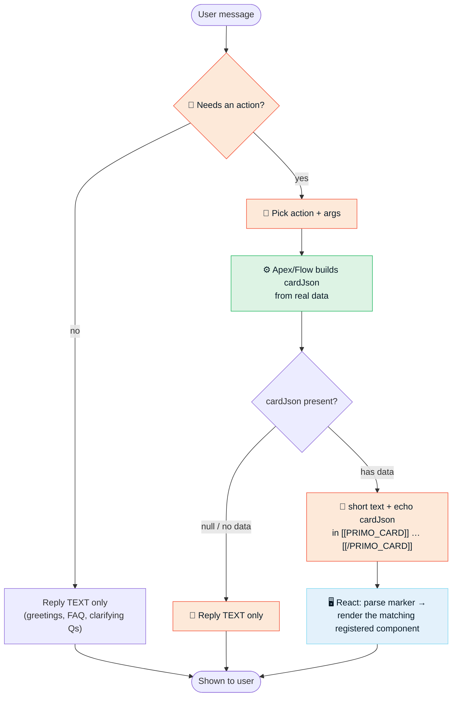

# Solution Workspace — Generative UI Cards on Agentforce V2 (Agent Script) + Custom Chat

> **TL;DR** — Agentforce's native rich-UI components (**Custom Lightning Types / CLT**) render
> **only** inside the native chat surfaces (MIAW / Enhanced Web Chat). If you build your **own**
> chat (React, mobile, embedded) on top of the **Agent API** (`/einstein/ai-agent/v1`), that
> channel returns **text only** and CLTs never render. **Solution:** the server (Apex/Flow)
> produces the card data as compact JSON, the agent **echoes it verbatim inside a text marker**
> (`[[PRIMO_CARD]]…[[/PRIMO_CARD]]`), and your frontend parses the marker and renders its own
> pre-built components. *Model picks the component; server owns the data; frontend owns rendering.*
>
> **Output of this solution:** a reusable **Claude Code skill** ([`../skill/SKILL.md`](../skill/SKILL.md))
> that recreates the pattern on any Agent Script agent, plus sanitized reference code in
> [`../examples/`](../examples/).

---

## 1. Problem / Use Case

You want **rich, branded, interactive cards** (carousels, order summaries, tracking, refunds, …)
inside a conversational agent experience — not just plain text.

Salesforce Agentforce **does** offer native generative UI via **Custom Lightning Types (CLT)**.
But there is a hard structural constraint:

- **CLTs render only on the native surfaces** — the **MIAW / Enhanced Web Chat** widget
  (and only with Chat V2 + the right connection config). Their renderers are LWCs bound to the
  native chat runtime (`lightningDesktopGenAi`, `enhancedWebChat`).
- **The Agent API returns text only.** The moment you embed a **custom chat** (your own React app
  on Experience Cloud, a mobile client, an embedded widget) and talk to the agent through the
  **Agent API** (`/einstein/ai-agent/v1`), you get back plain text. The structured component
  payload a CLT needs is **not carried** on this channel — in practice the structured
  `messages[].result[]` array is **not reliably populated** for custom-client surfaces, so it
  arrives empty.

**Net effect:** *Agent Script agent (V2) + custom React frontend + Agent API ⇒ CLTs are
unusable.* Out of the box, a custom chat can only show what the agent writes as **text**.

> This is a **platform limitation**, not a bug in your build. The pattern below is the
> production-proven way around it.

---

## 2. Solution adopted (textual brief)

We reproduce **controlled generative UI** with a **transport-agnostic marker convention** instead
of relying on the native CLT renderer:

1. **The server produces the card.** Each backing **Apex/Flow action** that should drive a card
   returns — alongside its normal outputs — one extra string field, `cardJson`: a small, flat JSON
   with a **`type`** discriminator (e.g. `{"type":"orderSummary","items":[…],"total":"6.50"}`),
   built **entirely server-side from real data** (never invented by the model). `null` when there
   is no data.
2. **The agent echoes it inside a marker.** The Agent Script instructions tell the agent: after a
   short text answer, append the `cardJson` value **exactly as returned**, wrapped in
   `[[PRIMO_CARD]]…[[/PRIMO_CARD]]`. Because it is just text, it **survives the text-only Agent API
   channel**. The model only decides *whether* to attach a card (agentic control); it does not
   rewrite the data.
3. **The frontend parses and renders.** The client scans each reply for the marker, `JSON.parse`s
   the payload, **strips the marker from the visible text** (users never see raw JSON), validates
   the `type`, and renders the matching **pre-built** component.

**Why this is the right trade-off**
- **No dependency on native rendering** → works on any surface that returns text (web, mobile, embedded).
- **Deterministic & safe** → card contents computed in Apex/Flow; the model can't invent prices,
  allergens, ETAs, refund amounts. Business rules stay in code, not in the prompt.
- **Graceful** → malformed/missing marker ⇒ the parser ignores it and shows the text; the chat never breaks.
- **Additive / non-destructive** → `cardJson` is an *extra* output. If a native CLT also exists for
  MIAW, it stays untouched — the **same agent feeds both** the native widget and your custom chat.

**Variant — proxy-side tag expansion (for data the model tends to invent).** For cards whose data
the LLM "thinks it already knows" (e.g. time slots), it may hallucinate the JSON. In that case the
agent writes only a **short tag** (`[[CARD:deliveryTime]]`, `[[CARD:orderSummary:<items>]]`, or an
inline `[[TOTAL:<items>]]`) and the **Apex proxy expands the tag** into the real
`[[PRIMO_CARD]]{…}` block using the server builders. The model never touches the JSON at all.
*(Rule of thumb: data the model would invent → tag expanded by the proxy; data from an action the
model must call anyway (e.g. place-order) → `cardJson` directly in the marker.)*

---

## 3. Architecture

### 3.1 Component & data flow

```
┌──────────────────────────┐
│  Custom chat (React)      │   Experience Cloud site — full brand/UX control
│  · fetch (same-origin)    │
└────────────┬─────────────┘
             │  POST /services/apexrest/primo/{session,message}
             ▼
┌──────────────────────────┐
│  Apex REST proxy          │   why a proxy:
│  (urlMapping /primo/*)    │   · browser can't call api.salesforce.com (CORS/CSP)
│  · OAuth client_credent.  │   · OAuth Consumer Secret must stay server-side
│  · marker post-processing │   · can expand [[CARD:…]] / [[TOTAL:…]] tags
└────────────┬─────────────┘
             │  Bearer token → POST /agents/{id}/sessions , /sessions/{id}/messages
             ▼
┌──────────────────────────┐
│  Agent API                │   /einstein/ai-agent/v1   (TEXT-ONLY channel)
└────────────┬─────────────┘
             ▼
┌──────────────────────────┐        ┌───────────────────────────┐
│  Agent (Agent Script, V2) │───────▶│  Apex / Flow actions       │
│  Atlas reasoning · topics │  calls │  build cardJson from data  │
│  echoes cardJson in marker│◀───────│  (Data Cloud / CRM)        │
└──────────────────────────┘ outputs└───────────────────────────┘
```

### 3.2 Sequence — who does what, per turn



### 3.3 Decision flow — when a card appears



---

## 4. Prerequisites for development (org vademecum)

Enable / verify on the org **before** implementing:

| # | Requirement | Why / how |
|---|---|---|
| 1 | **Agentforce / Agent Script (V2) enabled** | You need an `AiAuthoringBundle` agent you can `publish`/`activate` with the `sf` CLI. |
| 2 | **An Agent Script agent that already works and returns text** in your custom chat | The pattern is additive on top of a working agent. |
| 3 | **Agent API access** (`/einstein/ai-agent/v1`) | The channel your custom chat uses. Reached server-side via the proxy. |
| 4 | **Connected App / External Client App with OAuth `client_credentials`** | The proxy mints a Bearer token per request. Store Consumer Key/Secret in **Custom Metadata** (e.g. `Agent_API_Config__mdt`) — never in source. Set a run-as user for the client-credentials flow. |
| 5 | **Apex REST proxy** (`@RestResource urlMapping='/…/*'`) | Same-origin endpoint for the browser (solves CORS/CSP + keeps the secret server-side). |
| 6 | **A custom chat client you control** (React/mobile/embedded) hosted where it can call the proxy same-origin (e.g. an **Experience Cloud** site / UI bundle). | If instead you use the native MIAW widget, you don't need this pattern — use native CLT. |
| 7 | **CSP Trusted Sites** for any external assets the cards load (e.g. images CDN). | Otherwise images in cards are blocked by CSP. |
| 8 | **Guest/user data access for card-building actions** | If an action reads custom objects to price/populate the card and runs under a **Site Guest User**, either grant the object read or query `WITH SYSTEM_MODE` for public reference data (e.g. a menu/catalog) — otherwise totals/fields come back empty. |
| 9 | `sf` CLI + publish/activate rights | To validate/publish/activate the agent and deploy metadata. |

---

## 5. How To (build it + have Claude replicate it)

The end-to-end recipe lives in [`../guide/RECIPE.md`](../guide/RECIPE.md); the reusable automation
is the skill in [`../skill/SKILL.md`](../skill/SKILL.md). This section is the orientation on top.

### 5.1 The build, in six moves
1. **Design the card contract** — list which actions drive a card; define a small, flat JSON per
   card with a `type` discriminator.
2. **Emit `cardJson` server-side** — add one `String cardJson` output to each backing Apex/Flow
   action; build it from real data; `null` when empty. *(Flow: add it as a Flow output variable or
   `publish` fails on a schema mismatch.)*
3. **Wire the Agent Script** — declare `cardJson` as `is_displayable: True` and add a **CARD
   RENDERING** instruction ("append verbatim in `[[PRIMO_CARD]]…`, at most once, never narrate,
   never when empty").
4. **Publish & verify the marker** — `validate` → `publish` → `activate`; confirm via
   `sf agent preview` that the reply contains `[[PRIMO_CARD]]{…}[[/PRIMO_CARD]]`.
5. **Parse in the client** — tolerant regex parser: extract, `JSON.parse`, validate `type`, strip
   the marker from the visible text.
6. **Render** — one `switch (card.type)` → your pre-built, on-brand components; unknown types render nothing.

### 5.2 What to tell Claude (to replicate the pattern)
Install the skill, then describe the goal — the skill drives the rest:

```bash
mkdir -p ~/.claude/skills/agentscript-generative-ui-cards && \
  curl -fsSL https://raw.githubusercontent.com/mmartorana93/agentscript-generative-ui-cards/main/skill/SKILL.md \
    -o ~/.claude/skills/agentscript-generative-ui-cards/SKILL.md
```

Then, in Claude Code, a prompt like:

> "Add graphic cards to my custom Agentforce chat. It's an Agent Script agent consumed by a React
> chat over the Agent API. Start with an **order-summary** card: the Apex action already computes
> items + total — add a `cardJson` output, wire the agent to echo it in the `[[PRIMO_CARD]]` marker,
> and add the React parser + a component. Keep it additive; don't touch existing outputs."

The skill will: find the `.agent` bundle, add the `cardJson` output + CARD RENDERING instruction,
scaffold the Apex output, add the client parser + a renderer, and walk through
validate/publish/activate + the `preview` check.

### 5.3 Two hard-won gotchas (must-know)
- **Publish can drop planner surfaces.** On some orgs `sf agent publish` regenerates the
  `GenAiPlannerBundle` **without** the `<plannerSurfaces>` block that enables your external client
  surface (e.g. `CustomerWebClient`). If the custom chat stops responding after a publish: retrieve
  the new planner bundle, re-add `<plannerSurfaces>` before `<plannerType>`, deploy, then activate —
  **after every publish**.
- **Guest context returns empty data.** A card-building action running under the Site Guest User
  with no access to the object it queries returns empty values (e.g. total `0.00`). Fix with a
  permission grant or `WITH SYSTEM_MODE` for public reference data.

### 5.4 Output of this solution
Beyond this document, the deliverable is the **reusable Claude Code skill**
([`../skill/SKILL.md`](../skill/SKILL.md)) — so any team can recreate the pattern on their own agent
without re-deriving it — plus the sanitized reference code in [`../examples/`](../examples/).

---

## 6. Useful resources

- **Concept & inspiration:** DeepLearning.AI — *[Build Interactive Agents with Generative UI](https://www.deeplearning.ai/courses/build-interactive-agents-with-generative-ui)*
  (defines *controlled generative UI*; teaches it with CopilotKit `useComponent()` on Node/React —
  this repo adapts the same idea to Agent Script + Agent API).
- **Reusable skill:** [`../skill/SKILL.md`](../skill/SKILL.md) — Claude Code skill that recreates the pattern.
- **Step-by-step recipe:** [`../guide/RECIPE.md`](../guide/RECIPE.md).
- **Reference code (sanitized):** [`../examples/`](../examples/) — Apex action (`BuildOrderSummary.cls`),
  Agent Script (`chef-and-guardian.agent.txt`), React parser + renderer (`primoCards.ts`, `PrimoCards.tsx`).
- **Salesforce docs:** Agent API (`/einstein/ai-agent/v1`), Agent Script (`AiAuthoringBundle`),
  Custom Lightning Types (native generative UI on MIAW), Experience Cloud + Apex REST, CSP Trusted Sites.

---

*Proven on the "Primo" Agentforce Agent Script service agent (food-delivery demo) with a custom
React chat on Experience Cloud over the Agent API. Built as part of the AFD360 team work by
Manuel Martorana ([@mmartorana93](https://github.com/mmartorana93)) and Francesco Angelini
([@fraangel](https://github.com/fraangel)).*
