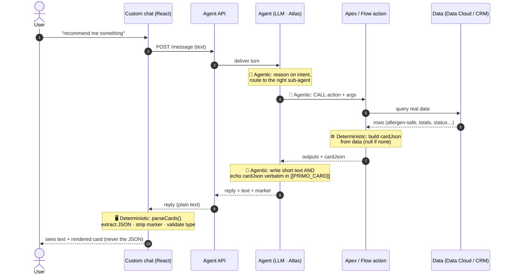

# Generative UI Cards for Agent Script (Salesforce Agentforce)

Render **rich, branded graphic cards** inside a **custom chat UI** driven by a Salesforce
**Agent Script** (Agentforce) agent — even though that path doesn't natively support them.

> **TL;DR** — Agentforce's native generative-UI components (CLT / Custom Lightning Types) only
> render inside the native chat surfaces (MIAW / Enhanced Web Chat). If you build your **own**
> chat on top of the **Agent API** (text-only REST), you get plain text back. This repo shows a
> small, production-proven pattern that gives you rich cards anyway: **the server produces the card
> data as JSON, the agent echoes it verbatim inside a text marker, and your frontend parses the
> marker and renders its own components.** Model picks the component; server owns the data.

This repo contains:
- 📘 **[`guide/`](guide/)** — the concept, architecture, and a step-by-step recipe.
- 🧩 **[`skill/SKILL.md`](skill/SKILL.md)** — a Claude Code / agent **skill** that automates recreating
  this pattern on any Agent Script agent.
- 💡 **[`examples/`](examples/)** — sanitized, real code from a working build (Apex action, Agent
  Script action + instruction, React parser + renderer).

---

## Background: what "Generative UI" is (and the flavor we use)

This work was directly inspired by the DeepLearning.AI short course
**[Build Interactive Agents with Generative UI](https://www.deeplearning.ai/courses/build-interactive-agents-with-generative-ui)**.
It defines a spectrum:

- **Generative UI** — agents respond with fully interactive interfaces, not just text.
- **Declarative / open-ended generative UI** — the model composes the UI on the fly. Maximum
  flexibility, less predictable, harder to keep on-brand and safe.
- **Controlled generative UI** *(what we use)* — the agent can only render components you have
  **explicitly registered**. Each component is a typed contract; the agent just passes structured
  data into a component **you** built.

Why controlled: **easy to implement, high visual polish, strong safety** (the model can only trigger
components you authored, with server-validated data). The trade-off is that each new card is a bit of
frontend work — a good deal for high-traffic, on-brand, mission-critical UX.

> The course teaches this with **CopilotKit + `useComponent()`** on a Node/React stack, where the
> framework wires a registered React component to a tool contract. **This repo adapts the same
> *idea* to Salesforce Agent Script + the Agent API**, where there is no such runtime hook — so we
> reproduce "controlled generative UI" with a transport-agnostic **marker convention** instead.

---

## The problem (Salesforce specifics)

Agentforce *does* have native generative UI — **CLT (Custom Lightning Types)** rendered in the chat.
But that renderer **only exists on the native surfaces**: the MIAW / Enhanced Web Chat widget (and it
requires Chat V2 + the right connections). If your product embeds a **custom chat** (React, mobile,
etc.) that talks to the agent through the **Agent API** (`/einstein/ai-agent/v1`), the API returns
**text only** — it does not carry the structured component payloads the native renderer needs.

So out of the box, a custom chat can only show what the agent writes as text.

## The pattern: a marker convention

```
┌─────────────┐   cardJson    ┌──────────────┐   [[PRIMO_CARD]]{...}   ┌──────────────┐
│  Apex action│──────────────▶│  Agent Script│────────────────────────▶│  Your frontend│
│ builds JSON │  (server data)│  echoes it   │   (plain text on the    │ parses marker,│
│ (the "card")│               │  in a marker │    Agent API channel)   │ renders card  │
└─────────────┘               └──────────────┘                         └──────────────┘
      1                              2                                        3
```

1. **The action produces the card data.** Each action that should drive a card returns, alongside
   its normal outputs, one extra string field (`cardJson`) — a compact JSON with a `type`
   discriminator, e.g. `{"type":"orderSummary","items":[...],"total":"6.50",...}`. Built entirely
   **server-side** from real data (never invented by the LLM).

2. **The agent echoes it inside a sentinel marker.** The agent's instructions say: after your short
   text answer, append the `cardJson` value **exactly as returned**, wrapped in
   `[[PRIMO_CARD]]…[[/PRIMO_CARD]]`. The model only decides *whether* to include a card (control); it
   does not rewrite the data. Because it's just text, it survives the text-only Agent API channel.

3. **The frontend parses and renders.** The client scans each reply for the marker, `JSON.parse`s the
   payload, **strips the marker from the visible text** (users never see raw JSON), validates the
   `type`, and renders the matching **pre-built** component.

### Example: what the agent actually returns

```
Here's your order summary — confirm to place it!
[[PRIMO_CARD]]{"type":"orderSummary","items":[{"name":"Bruschetta al Pomodoro","price":"6.50"}],"total":"6.50","deliveryAddress":"742 Elm Street…","eta":"32 minutes"}[[/PRIMO_CARD]]
```

The user sees *"Here's your order summary — confirm to place it!"* plus a branded card. The JSON and
marker are invisible.

---

## How it flows — and is it agentic?

**Yes, it stays fully agentic.** The LLM reasons about intent, **chooses which action to call** (with
arguments it extracts from the conversation), and then **decides whether and how** to surface a card.
The only *non*-agentic part is the **card's data**: that is computed by Apex/Flow from real records —
so the model can never invent prices, allergens, ETAs or refund amounts. In short: the model owns the
**decisions**, the server owns the **data**, the frontend owns the **rendering**.

### Sequence — who does what, in order



### State — the agent's decision points

```mermaid
flowchart TD
    A([User message]) --> B{"🧠 LLM reasoning<br/>Does this need an action?"}
    B -->|no| T["Reply with TEXT only<br/>(greetings, FAQ, clarifying Qs)"]
    B -->|yes| C["🧠 LLM picks action + args<br/>(e.g. build_meal_details)"]
    C --> D["⚙️ Apex/Flow executes<br/>builds cardJson from real data"]
    D --> E{cardJson present?}
    E -->|null / no data| F["🧠 LLM replies with text only"]
    E -->|has data| G["🧠 LLM: short text + echo cardJson<br/>inside &#91;&#91;PRIMO_CARD&#93;&#93; … &#91;&#91;/PRIMO_CARD&#93;&#93;"]
    G --> H["🖥️ React: parse marker →<br/>render the matching registered component"]
    T --> Z([Shown to user])
    F --> Z
    H --> Z

    classDef agentic fill:#FDE9D9,stroke:#F4543A,color:#081A27;
    classDef deterministic fill:#DDF3E4,stroke:#26B864,color:#081A27;
    classDef ui fill:#E3F1FB,stroke:#83D9F2,color:#081A27;
    class B,C,F,G agentic;
    class D deterministic;
    class H ui;
```



> **Why "controlled"?** The model can only pick from **actions you registered**, and can only attach a
> **server-produced** `cardJson`. The frontend renders **only the `type`s you pre-built** (unknown
> types render nothing). Maximum agency in the *decisions*; zero freedom to invent data or UI — which
> is what makes it safe and on-brand.

---

## Why it works well

- **No dependency on native rendering.** Sidesteps the Chat V2 / connection / channel config that
  gates the native CLT path. Works on any surface that can return text (web, mobile, embedded).
- **Deterministic & safe.** The card contents are computed in Apex/Flow, not hallucinated. Allergen
  filters, refund amounts, order data are guaranteed correct; the model can't alter them. Business
  rules live in code, never in the prompt.
- **Graceful by design.** If the marker is missing or the JSON is malformed, the parser ignores it
  and shows the text — the chat never breaks. Cards appear **only where they add value**; greetings
  and policy answers stay as text.
- **Full design control.** You own the components, so cards match your brand exactly.
- **Additive / non-destructive.** `cardJson` is an *extra* output. If the agent also has a native CLT
  component, it stays untouched — the same agent can feed both a native widget and your custom chat.

## When to use this vs. alternatives

| Situation | Use |
|---|---|
| Custom chat over the **Agent API** (React/mobile/embedded) | **This marker pattern** |
| Native **MIAW / Enhanced Web Chat** widget, Chat V2 available | Native **CLT** components |
| Node/React app with **CopilotKit** | `useComponent()` (the course's approach) |

---

## Get started

- Read **[`guide/RECIPE.md`](guide/RECIPE.md)** for the step-by-step implementation.
- Install the **[skill](skill/SKILL.md)** to have an agent recreate the pattern for you.
- Browse **[`examples/`](examples/)** for real, sanitized code.

## Credits & sources

- Concept & inspiration: **[Build Interactive Agents with Generative UI](https://www.deeplearning.ai/courses/build-interactive-agents-with-generative-ui)** (DeepLearning.AI).
- Pattern implemented and proven on a Salesforce Agentforce **Agent Script** service agent ("Primo",
  a food-delivery demo) with a custom React (Experience Cloud) chat over the Agent API.

### Authors

- **Manuel Martorana** ([@mmartorana93](https://github.com/mmartorana93))
- **Francesco Angelini** ([@fraangel](https://github.com/fraangel))

The reference "Primo" agent (Agent Script, backing Apex/Flows, and the UC1/UC2 flows the example
actions come from) was built together as part of the AFD360 team work.

## License

MIT — see [LICENSE](LICENSE).
